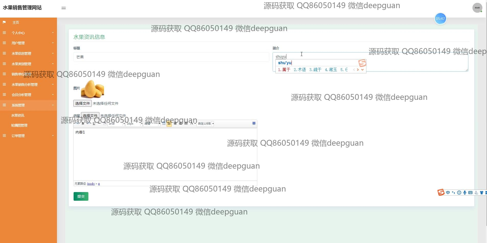
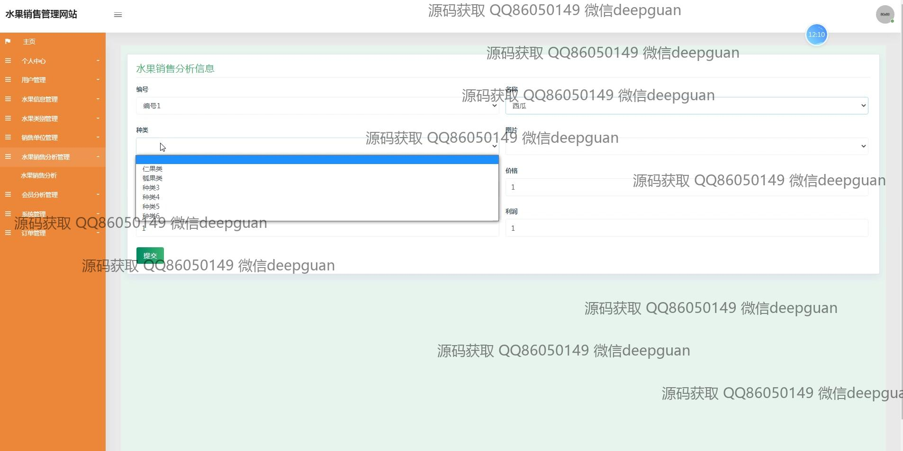

<h1 align="center">的水果销售网站</h1>

## 简介
水果销售管理网站：提供用户和管理员角色，多功能模块包括用户管理、订单管理、商品信息管理和销售分析，通过简洁界面实现高效销售管理和用户体验优化。    --计算机毕业设计源码；毕设源码；java毕业设计源码

## 联系方式

<h3 align="center">获取完整代码与数据库文件 + 微信：deepguan QQ: 86050149 QQ群: 783742310</h3>

<h3 align="center">可帮忙远程部署 包运行成功！提供远程部署、修改代码、设计文档指导、代码讲解等服务！</h3>

## 功能介绍（完整见运行截图）
管理员：基本功能包括登录、注册和退出系统。管理员可以通过后台管理用户信息、水果信息、类别管理、订单管理、销售分析等各项功能。系统提供用户信息管理功能，允许编辑用户的个人信息及审核注册用户。管理员能够管理水果品类，包括输入水果编号、名称、种类，上传水果图片及设定价格和库存。支持后台信息的发布与管理功能，包括发布新闻资讯或水果相关信息，查看修改或删除已发布内容。系统提供销售分析与统计功能模块帮助管理员得到销售数据和会员分析报告。

用户：基本功能包括系统登录、注册及退出服务。用户可以访问网站首页进行浏览与操作，通过每个功能模块更好地管理自己的购物体验。用户可以管理个人信息，通过账户页面查看或更改信息如姓名、联系信息和收货地址等。购物页面列出水果品类，可查看详细商品信息、购买指南以及将商品添加至购物车。用户还可以管理订单，进行订单查询与支付功能操作，订单确认后可选择收货地址和付款方式，支持在线支付（模拟）。

## 运行截图

本代码来源于网络,仅供学习参考使用!

